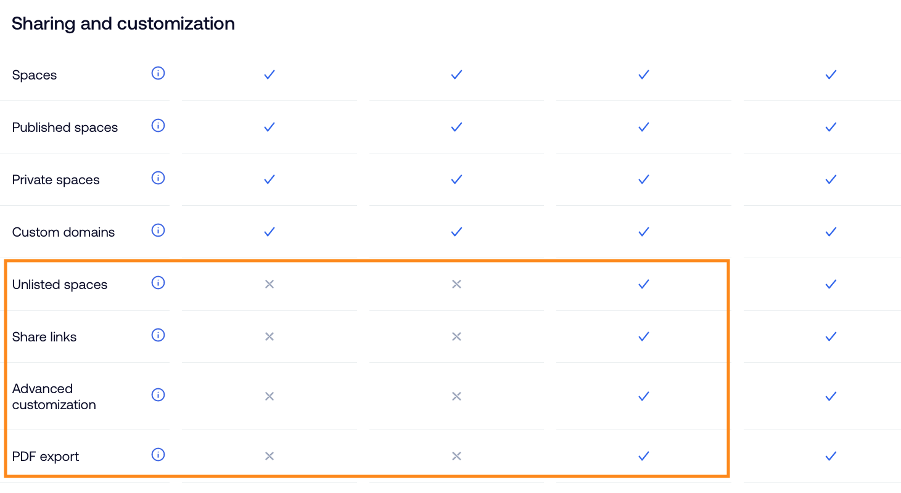
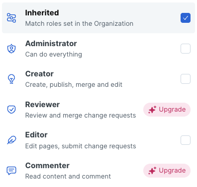

# 🍀 Plus vs Pro ??

## 플러스(Plus) 요금제

* For small teams that want to collaborate and document publicly.

## 프로(Pro) 요금제

* For multi-role teams who want advanced publishing and collaboration options.

### _공유 및 커스토마이징 기능 (Sharing and customization)_

<figure><figcaption></figcaption></figure>

* **(Unlisted spaces) only accessible by the URL,**
* &#x20;
* &#x20;.png>)
* **(Advancded customization)** customize logo, theme, colors and fonts to create branded docs.
* &#x20;.png>)\

### _Integrations_

<figure><figcaption></figcaption></figure>

### _Data & insights_

### _Member Management_

### _Security & Compliance_

### _Support_

<figure><figcaption></figcaption></figure>

